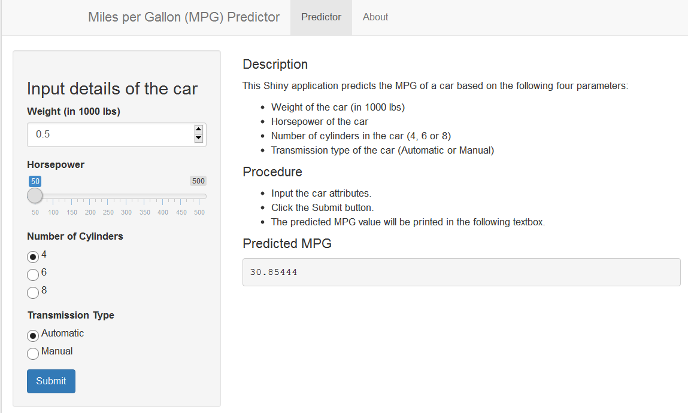

MPGPredictor - Predict the Miles per Gallon (MPG) of a Car
========================================================
author: Ross Flieger-Allison
date: 21 June 2015
transition: rotate

Introduction
========================================================

This presentation is part of the Course Project for the Coursera Developing Data Products class. The peer assessed assignment has two parts.

1. Shiny app
2. R Presentation describing the Shiny app in 5 pages.

The Shiny app is hosted on [ShinyApps.io](https://rfoxfa.shinyapps.io/Coursera-DevelopingDataProducts).

The R Presentation is available at [RPubs](http://rpubs.com/rfoxfa/88846).

Source code for ui.R and server.R files are available in my [GitHub repository](https://github.com/rfoxfa/Developing_Data_Products_Course_Project).


mtcars Dataset
========================================================

The app uses the mtcars dataset which comes from the Motor Trend Car Road Tests (mtcars) dataset. The data was extracted from the 1974 Motor Trend US magazine, and comprises fuel consumption and 10 aspects of automobile design and performance for 32 automobiles (1973-74 models).


```r
head(mtcars)
```

```
                   mpg cyl disp  hp drat    wt  qsec vs am gear carb
Mazda RX4         21.0   6  160 110 3.90 2.620 16.46  0  1    4    4
Mazda RX4 Wag     21.0   6  160 110 3.90 2.875 17.02  0  1    4    4
Datsun 710        22.8   4  108  93 3.85 2.320 18.61  1  1    4    1
Hornet 4 Drive    21.4   6  258 110 3.08 3.215 19.44  1  0    3    1
Hornet Sportabout 18.7   8  360 175 3.15 3.440 17.02  0  0    3    2
Valiant           18.1   6  225 105 2.76 3.460 20.22  1  0    3    1
```


Using the MPGPredictor app
========================================================

To use the application, just input the following:

1. Weight of the car (in 1000 lbs)
2. Horsepower of the car
3. Number of cylinders in the car (4, 6 or 8)
4. Transmission type of the car (Automatic or Manual)

Click the Submit button

The predicted MPG value for the car will be displayed in the corresponding output box in the main panel.


MPGPredictor app screen
========================================================


